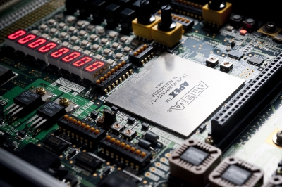

# CPU 設計演習

## はじめに

本実験では，FPGA (Field Programmable Gate Array) と呼ばれる「回路を書きかえられる」 LSI を用いて，マイクロプロセッサの設計と作成をおこないます．上の写真は，FPGA が搭載された評価ボードの写真です．写真中央の銀色のチップが FPGA です．

設計は，HDL (Hardware Description Language) と呼ばれる言語をつかって行います．HDL によって記述された設計情報を FPGA に転送し，回路を書きかえることで FPGA や評価ボードがコンピュータとして動作します．

本実験は[スケジュール](docs/schedule.md)にしたがって進めてください．

## 目次
この Wiki の内容は以下のとおりです：

* [スケジュール](docs/schedule.md)
* [実験の準備](docs/setup.md)
* [作成するプロセッサの仕様](docs/specification.md)
* [チュートリアル](docs/tutorial.md)
* [高速化に向けて](docs/optimize.md)
* ツール
    * [ModelSim](docs/modelsim.md)
    * [Quartus Prime](docs/quartus.md)
* 言語
    * [Verilogの記法について](docs/verilog.md)
    * [HDLの記述例](docs/hdl.md)
* [デバッグ](docs/debug.md)
* [アセンブルについて](docs/assembler.md)
* [性能評価の仕方](docs/evaluation.md)
